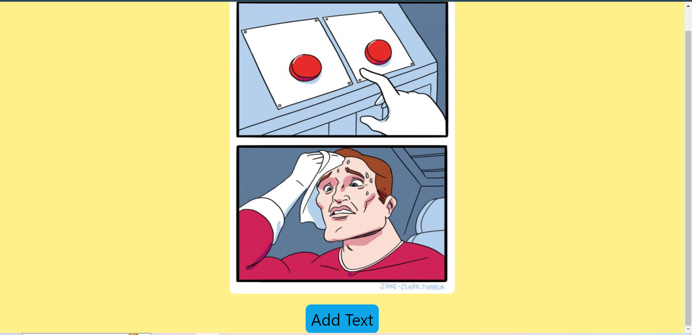
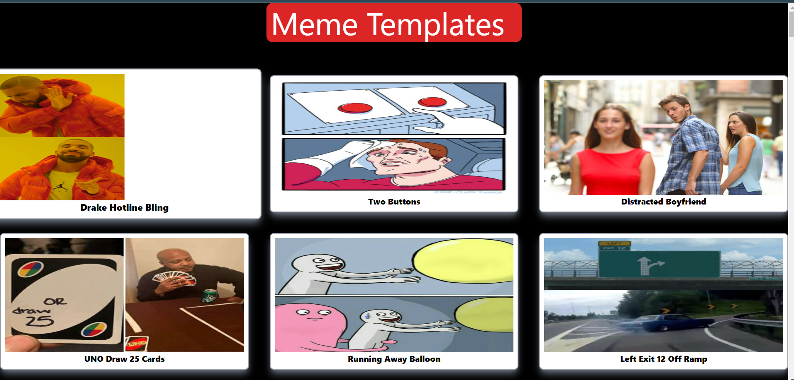

# This is a Simple Meme Editor Application!

### You will be provided with various Meme Templates and you can edit them accordingly here in the app itself!






## Installation


Clone the repository in your local System!

```
git clone url

```

Install necessary Modules

```
npm install
```

Go to the project Directory

```
cd memes
```
Run the Project
```
npm run dev
```